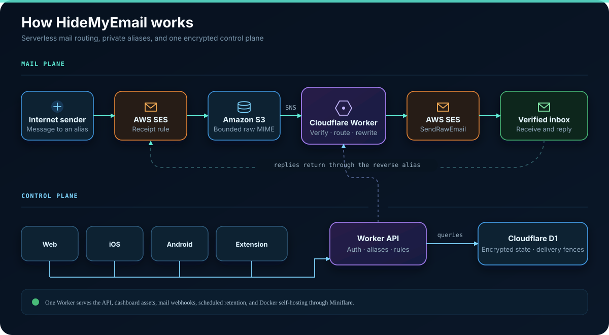

<p align="center">
  
</p>

<p align="center">
  <a href="https://app.hidemyemail.dev">App</a>
  ·
  <a href="https://testflight.apple.com/join/9576b67z">TestFlight</a>
  ·
  <a href="https://tilianb.github.io/hidemyemail/">Documentation</a>
</p>

# HideMyEmail

Self-hosted email aliases for your domains. The serverless deployment uses a
Cloudflare Worker, Cloudflare D1, and AWS SES/S3/SNS. Docker can use that same
mail pipeline or receive and send SMTP without AWS. Native **iOS** and
**Android** apps are included.

<p align="center">
  <a href="https://deploy.workers.cloudflare.com/?url=https://github.com/tilianb/hidemyemail">
    
  </a>
</p>

## Why

The default serverless path needs no VPS or mail stack. SES receives mail, S3
stores the raw MIME, SNS calls the Worker, and the Worker forwards through SES.
Docker operators can instead use built-in SMTP, an external gateway, a provider
relay, or direct delivery. Replies work from your normal inbox, and recipients
see the alias.

## How it compares

|  | HideMyEmail | SimpleLogin | addy.io | Cloudflare Email Routing | ImprovMX |
|---|---|---|---|---|---|
| Self-host without a mail server | ✅ serverless (Workers + SES) | ❌ full mail stack (Postfix) | ❌ full mail stack | n/a (hosted only) | n/a (hosted only) |
| Reply / send from alias | ✅ | ✅ | ✅ | ❌ | ✅ paid |
| Catch-all + on-the-fly aliases | ✅ | ✅ | ✅ | ❌ manual rules | ✅ |
| Per-alias / per-subdomain block & allow rules | ✅ | ✅ | ✅ | ❌ | ❌ |
| Bounce/complaint auto-suppression | ✅ | ✅ | ✅ | n/a | n/a |
| Multi-user with admin panel | ✅ | hosted plans | hosted plans | ❌ | ❌ |
| Native mobile apps | ✅ iOS + Android | ✅ | ❌ | ❌ | ❌ |
| Typical self-host cost | ~$0 + SES cents | VPS $5+/mo | VPS $5+/mo | free (limited) | $9+/mo |
| Open source | ✅ MIT | ✅ | ✅ | ❌ | ❌ |

<p align="center">
  
</p>

## Features

- Aliases on your own domain, including catch-all auto-create.
- Forwarding to verified destination inboxes. Spam and virus verdict handling
  protects your domain's sender reputation from forwarded junk.
- Reply-from-alias without exposing your inbox. SPF/DMARC
  checks, first-contact verification, and outbound rate caps gate this feature.
- RFC 8058 one-click unsubscribe to disable aliases. It applies to mail
  resembling bulk mail. Personal forwards stay clean.
- Bounce/complaint feedback loop with automatic destination suppression.
- Per-subdomain policies and scoped block/allow sender rules.
- Dashboard for aliases, domains, destinations, rules, users, MFA,
  passkeys, and admin settings. It includes data export and account deletion,
  with inline passphrase/MFA or passkey confirmation for sensitive actions.
- Native [iOS](ios/README.md) and [Android](android/README.md) apps:
  passphrase + TOTP or passkey sign-in, alias/domain/destination/rule
  management, stats, and push notifications (APNs / FCM).
- Origin-bound native credentials, one-time PKCE web handoff, and recovery
  that revokes sessions, MFA, passkeys, and API keys.
- Bounded mail ingress, SNS signature and topic checks, replay-safe delivery,
  encrypted destination addresses, and atomic mail quotas.

## Quick start

### Docker self-host

```bash
git clone https://github.com/tilianb/hidemyemail.git
cd hidemyemail/docker
cp .env.example .env
$EDITOR .env
docker compose pull
docker compose up -d
```

Open <http://localhost:8787>. Compose publishes to loopback only; put a TLS
reverse proxy in front for public access and preserve its trusted client-IP
header contract. Docker can receive Internet SMTP itself on port 25 with
bundled scanning, or use SES or an advanced external gateway. It can send
through SES, a provider SMTP relay on 587/465, or directly to recipient MX
servers on port 25. This lets hosts that block outbound port 25 receive locally
while forwarding through a relay. Sending and receiving are independent. See
[Docker self-hosting](docker/README.md) and the [mail provider guide](docs/MAIL_PROVIDERS.md).

### Cloudflare Worker

```bash
git clone https://github.com/tilianb/hidemyemail.git
cd hidemyemail
cd dashboard && npm ci && npm run build
cd ../worker && npm ci
npm run deploy
```

You also need D1 databases, Worker secrets, SES/S3/SNS, and DNS. Follow [Getting started](docs/GETTING_STARTED.md), then [Deployment guide](docs/DEPLOY.md).

## Documentation

- [Getting started](docs/GETTING_STARTED.md)
- [Deployment guide](docs/DEPLOY.md)
- [AWS SES setup](docs/AWS_SES_SETUP.md)
- [Mail providers and external gateways](docs/MAIL_PROVIDERS.md)
- [Configuration](docs/CONFIGURATION.md)
- [API (addy.io-compatible)](docs/API.md)
- [Troubleshooting](docs/TROUBLESHOOTING.md)
- [Security notes](docs/SECURITY.md)
- [Docker self-hosting](docker/README.md)
- [iOS app](ios/README.md)
- [Android app](android/README.md)
- [Roadmap](docs/ROADMAP.md)

## Development

```bash
cd worker
npm ci
npm test
npx tsc --noEmit

cd ../dashboard
npm ci
npm run build
```

For local Worker development, copy `worker/.dev.vars.example` to `worker/.dev.vars` and supply local values.

## License

MIT. See [LICENSE](LICENSE).
